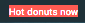
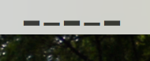
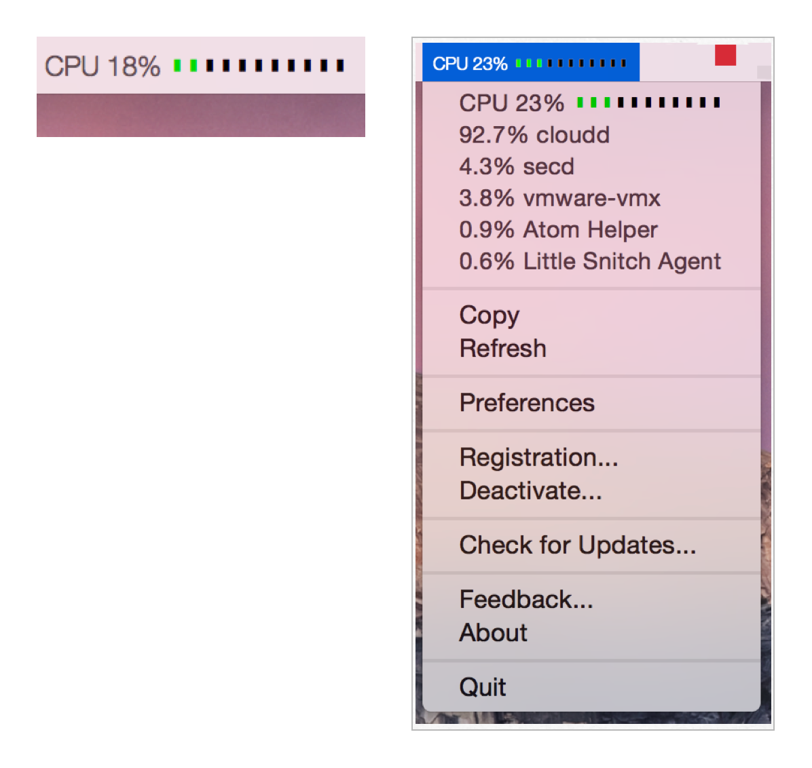
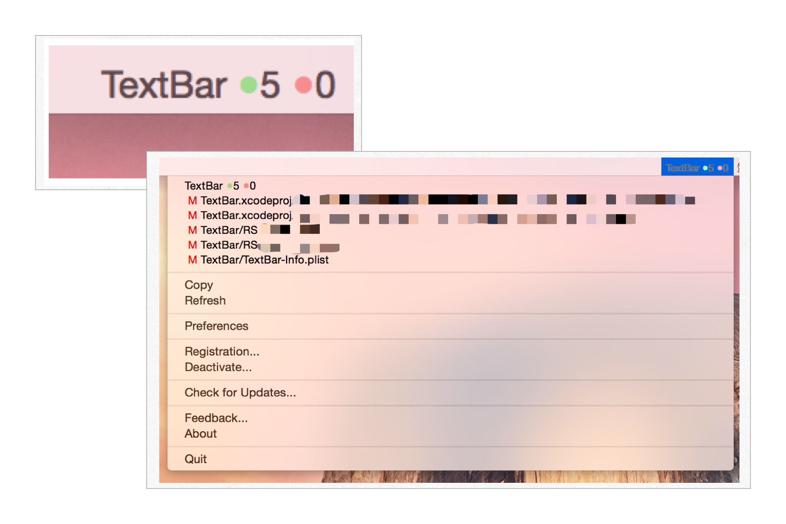
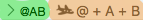
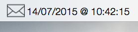
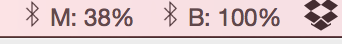
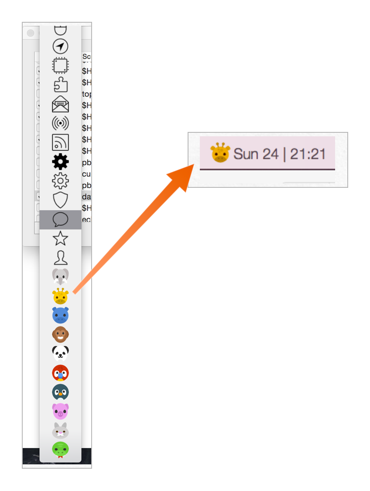
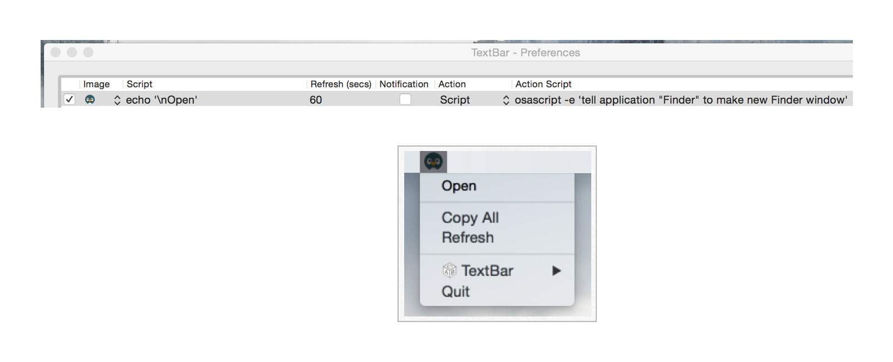

# TextBar-Recipes

## What?
Recipes for TextBar app [www.richsomerfield.com/apps](http://www.richsomerfield.com/apps).

## Contributions
Please submit pull-requests so that I can add your ideas/scripts.

## Latest Major Features

[Release Notes](http://www.richsomerfield.com/apps/textbar/releasenotes_textbar.html)

## Recipies

### What is my Local IP address?
    ifconfig | grep inet | grep -v inet6 | cut -d" " -f2 | tail -n1

### What is my external IP address?
    curl http://ipinfo.io/ip

### What is my latency to Google's DNS Servers?
    ping -c 1 8.8.8.8 | awk -F" |=" '/time/{print $10"ms"}'

### Display Ping Time to a Specified Server
    $HOME/scripts/pingTime.sh google.com
> Download pingTime.sh to your machine (to ~/scripts), and then add this to TextBar.

### How much disk space am I using?
    df / | awk '{ print $5 }' | tail -n 1

### What is the time in a different country (e.g. UK)?
    UKDATE=\`TZ=GB date +"%H:%M %p"\` ; echo "UK: $UKDATE"

### Is my website running?
    ALIVE=\`curl -Is www.google.com | grep -q "200 OK"\` && echo "Google Alive" || echo "Google Dead"

### Smiley
    echo '😀'
> Easiest way to see other emoji is; Open TextEdit, then "Edit > Emoji & Symbols". Then just copy and paste into TextBar.

### Colored text
    if [ $((`date +"%S"`%2)) -eq 0 ]; then echo "\e[41mHot donuts now"; else echo "\e[42mHot donuts now"; fi
> [MPU 321 - 58mins](https://www.relay.fm/mpu/321)

> Set the refresh to 1 secs for flashing text.



### What is my battery charge?
    ioreg -n AppleSmartBattery -r | awk '$1~/Capacity/{c[$1]=$3} END{OFMT="%.2f%%"; max=c["\"MaxCapacity\""]; print (max>0? 100*c["\"CurrentCapacity\""]/max: "?")}'

### Show CPU 'graph'
    $HOME/scripts/CPUSpeed.sh
> Download CPUSpeed.sh to your machine (to ~/scripts), and then add this to TextBar.
> Note: This is fairly basic. It is very slow to use ```top``` to calculate the CPU, but, I've not come across a better way yet.



### Show CPU 'graph' - version 2
    $HOME/scripts/cpubar.sh


> Download cpubar.sh to your machine (to ~/scripts), and then add this to TextBar.
> Requires TextBar 1.5.174 or later.

### Show Mem 'graph'
    $HOME/scripts/membar.sh

> Download membar.sh to your machine (to ~/scripts), and then add this to TextBar.
> Requires TextBar 1.5.174 or later.

### What song (and artist) is playing in iTunes?
    osascript -e 'if application "iTunes" is running then' -e 'tell application "iTunes"' -e 'if player state = playing then' -e '(get name of current track) & " – " & (get artist of current track)' -e 'else' -e 'return ""' -e 'end if' -e 'end tell' -e 'else' -e 'return ""' -e 'end if'
> If iTunes is running and a song is playing, this will display the current song name and artist name.

### What song (and artist) is playing in Spotify?
    osascript -e 'if application "Spotify" is running then' -e 'tell application "Spotify"' -e 'if player state is playing then' -e 'return "♫ " & (artist of current track as string) & " - " & (name of current track as string)' -e 'end if' -e 'end tell' -e 'end if'
> If Spotify is running and a song is playing, this will display the current song name and artist name.

### Weather
    curl -s 'http://api.openweathermap.org/data/2.5/weather?q=Manchester,UK&units=metric' | python -c 'import sys, json; data=json.load(sys.stdin); print("{} : {:.1f}°C".format(data["weather"][0]["main"], data["main"]["temp"]))'


> Don't refresh too frequently as this service is rate limited.
> You'll need to change "Manchester,UK" to your location, unless you actually live in Manchester :-).

### Unicode Weather
    curl weather.mar.cx/Manchester,_UK | grep "<title>" | cut -d'>' -f2 | cut -d' ' -f1
> This is likely to break as it isn't entirely robust. Edit the location to get your weather.

### Show (Local) Git Repo Status
    $HOME/scripts/git_status.sh TextBar "$HOME/Code/TextBar"


> Download git_status.sh to your machine (to ~/scripts), and then add this to TextBar.
> Requires TextBar 1.5.174 or later

### Get Current ControlPlan context
    osascript -e 'tell application "ControlPlane" to get the current context' | sed -e 's: + ::g'


> I also remove the + between the contexts to save space (TextBar green, ControlPlane red).

### Unread Emails in AppleMail
    osascript -e 'tell application "Mail" to get the unread count of inbox'

### Unread Emails in Outlook
    osascript $HOME/scripts/CheckOutlookMail.scpt
> Download CheckOutlookMail.scpt to your machine (to ~/scripts), and then add this to TextBar.

### Date of Latest Email in AppleMail
    osascript $HOME/scripts/LatestEmail.scpt
> Download LatestEmail.scpt to your machine (to ~/scripts), and then add this to TextBar.



### Next Meeting in Outlook
    osascript $HOME/scripts/OutlookNextMeeting.scpt
> Download OutlookNextMeeting.scpt to your machine (to ~/scripts), and then add this to TextBar.
> Edit OutlookNextMeeting.scpt if you want the text formatted differently.
> Note: This only looks 60 mins into the future. You can edit OutlookNextMeeting.scpt if you want longer.

### Show the clipboard (text)
    pbpaste | sed 's/^[[:space:]]*//;s/[[:space:]]$//' | sed -E 's/^(.{10}).+$/\1.../'
> This looks more complex than you might imagine. It; strips leading and trailing whitespace, displays only 10 chars (and if it exceeds 10 characters, it'll display the ellipsis).
> Obviously, if you 'Copy to Clipboard' on this, you'll get the truncated text - but, as it is already on the clipboard, you don't need to copy it :-).

### Character Count of current clipboard
    pbpaste | wc -c

### Mouse and Keyboard Battery Status
    echo "M: "`ioreg -c BNBMouseDevice | grep '"BatteryPercent" ='  |  sed 's/[^0-9]*//g'`"%"
    echo "B:" `ioreg -c AppleBluetoothHIDKeyboard | grep '"BatteryPercent" ='  | sed 's/[^0-9]*//g'`"%"


> Add these as two separate items.

### Stackoverflow Reputation
    json=$(curl -s http://stackoverflow.com/users/flair/22656.json) && echo $json | sed 's/,//g;s/^.*reputation...\([0-9]*\).*$/\1/'
> (replace 22656 by your SO account number)

### Vagrant
    VBoxManage list runningvms | egrep -oh '[a-z]+_default' | awk -F'_' '{print $1}' | paste -s -d", " -
> Show all currently running vagrant boxes (VirtualBox only)

### Show Selected File in Finder
    osascript $HOME/scripts/SelectedFinderFile.scpt
> Download SelectedFinderFile.scpt to your machine (to ~/scripts), and then add this to TextBar.

### Show Outdated Formulae in Homebrew
    /usr/local/bin/brew update >/dev/null && /usr/local/bin/brew outdated | wc -l | awk '{print $1}' ; /usr/local/bin/brew outdated
> This will show the number of outdated formulae in the menubar; clicking the item will show the list of items that are outdated. Update the path to `brew` to match your system.

### Remind me to sit/stand
    test -f $HOME/tmp/stand && { echo "Stand" && rm $HOME/tmp/stand } || { echo "Sit" && touch $HOME/tmp/stand }
> Configure with whatever refresh frequency you want - in TextBar Preferences.

## ANSI Escape Colors
    echo 'Normal \e[41m Other '
> This is an example.
> Requires TextBar 1.5.174 or later

## Multi-line Scripts
    echo 'Hello' ; echo 'World' ; echo '!'
> Requires TextBar 1.5.174 or later

## HTML
From v1.3.3, TextBar can render _basic_ HTML into your TextBar item. The text must begin with ```<html>```, or end with ```</html>``` - must be in lowercase! - for it to be renderred as HTML.

The HTML support is fairly limited, it supports text and images. The text can be styled using embedded CSS, the images can't. Images should be resized to about 14x14.

### Hello World
    echo '<html><b>Hel</b>lo <i>wor</i>ld</html>'

### Display Image
    echo '<html></html>'
> You can't resize the image, so make sure it is 14x14 pixels for it to show correctly.

### CSS Styled Text
    cat '$HOME/scripts/apple.html'
> Download apple.html to your machine (to ~/scripts), and then add this to TextBar.

### Is my External drive mounted (with HTML Styled Text)?
    [ -d /Volumes/MyExtDrive ] && echo "<html><font face=\"helveticaneue-thin\"> MyExtDrive mounted</font></html>" || echo "<html><font face=\"helveticaneue-thin\">MyExtDrive <font color=red><b>not</b></font> mounted</font></html>"

### Show last 10 (ish) files backed-up by CrashPlan
    $HOME/scripts/CrashPlan.sh
> Download CrashPlan.sh to your machine (to ~/scripts). and then add this to TextBar.

## Preferences
> Requires TextBar v1.4.9 (or later)

I'm working on a UI screen for preferences, but, until then you can set the Default Font/Font-Size, and Shell using ```defaults write```

### How to set the default Font
    defaults write com.RichSomerfield.TextBar DefaultFontName -string "HelveticaNeue-UltraLight"
> Requires a restart of the TextBar app

### How to set the default Font-Size
    defaults write com.RichSomerfield.TextBar DefaultFontSize -int 10
> Requires a restart of the TextBar app

### How to set the default Shell
    defaults write com.RichSomerfield.TextBar DefaultShell -string "/bin/sh"
> Requires a restart of the TextBar app

### How to set the default Max Width of textbar items
    defaults write com.RichSomerfield.TextBar DefaultMaxWidth -int 100
> Requires TextBar v1.4.47 (or later)

> Requires a restart of the TextBar app

> Note: This is in points. Use '0' for unlimited.

> Note: This only works on OS X Yosemite (10.10)

### How to enable more default images
    defaults write com.RichSomerfield.TextBar DefaultAllImages -bool YES

> Requires a restart of the TextBar app to read the folder

### How to use your own images
    defaults write com.RichSomerfield.TextBar DefaultAdditionalImagesFolder -string "/Users/rich/images/png"

> Requires TextBar v1.6.1 (or later)

> Requires a restart of the TextBar app to read the folder

> Note: Only loads 'png' files

> Note: This will be moving to a new preferences UI when I get time to implement it

To remove use:

    defaults delete com.RichSomerfield.TextBar DefaultAdditionalImagesFolder

### How to set the default TextBar image size
    defaults write com.RichSomerfield.TextBar DefaultImageSize -int 18
> Requires TextBar v1.6.19 (or later)

> Requires a restart of the TextBar app

### How to set the default TextBar preferences image size
    defaults write com.RichSomerfield.TextBar DefaultMenuImageSize -int 18
> Requires TextBar v1.6.19 (or later)

> Requires a restart of the TextBar app

### How to set the default TextBar notification image size
    defaults write com.RichSomerfield.TextBar DefaultNotificationImageSize -int 18
> Requires TextBar v1.6.19 (or later)

> Requires a restart of the TextBar app

## Actions
Since v1.7.15, TextBar support custom actions. TextBar has, when you click on the text in the menubar, added the text to the clipboard. Now you can customize that behaviour to perform your own actions. Effectively you can build your own menu bar apps (i.e. app launcher, fav folder launcher, ...).

### How To
* Go to TextBar -> Preferences
* Change the Action to 'Script'
* Add your script

### Details
When your script runs, TextBar will pass two environment variables into the shell. These provide you with the index (i.e. position from 0...end in the menu list), and the actual text.

The two environment variables are:

* TEXTBAR_INDEX
* TEXTBAR_TEXT

### Basic Example
* Add an action script of "echo $TEXTBAR_INDEX $TEXTBAR_TEXT > $HOME/output.txt"

When you trigger this action, it'll send the index and text to the output.txt file.

### Spotify Example
* Download the following files:
    * ShowSpotify.scpt
    * SpotifyControl.scpt
* Copy them to your ~/scripts folder
* Configure a Textbar item to have a script of:
    * osascript $HOME/scripts/ShowSpotify.scpt
* Configure the Textbar item to have an action script of:
    * osascript $HOME/scripts/SpotifyControl.scpt

You should now be able to skip tracks and play/pause from the Textbar item.

### Quick Finder Launcher Example
* Create a new TextBar item with an image
* Configure your script to be:
    * echo "\nOpen"
* Configure your action script to be:
    * osascript -e 'tell application "Finder" to make new Finder window'

This'll only show the image in the menubar, but the 'Open' action will be shown in the menu.


If you want to have more launcher items, then you'll need to create the action script to check for the TEXTBAR_INDEX environment variable value in your action script.

### iCloud Tabs
* Download the following files:
    * icloudtabs.scpt
    * icloudtabsaction.scpt
* Copy them to your ~/scripts folder
* Create a new TextBar item
* Configure a Textbar item to have a script of:
    * echo 'Tabs' && python ~/scripts/icloudtabs.py
* Configure the Textbar item to have an action script of:
    * python ~/scripts/icloudtabsaction.py

This'll show your iCloud tabs from your other devices - it omits the tabs from the local machine.
