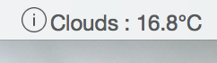

# TextBar-Recipes

## What?
Recipes for TextBar app (www.richsomerfield.com/apps).

## Contributions
Please submit pull-requests so that I can add your ideas/scripts.

## Recipies

### What is my Local IP address?
    ipconfig getifaddr en0

### What is my external IP address?
    curl http://ipinfo.io/ip

### How much disk space am I using?
    df / | awk '{ print $5 }' | tail -n 1

### What is the time in a different country (e.g. UK)?
    UKDATE=\`TZ=GB date +"%H:%M %p"\` ; echo "UK: $UKDATE"

### Is my website running?
    ALIVE=\`curl -Is www.google.com | grep -q "200 OK"\` && echo "Google Alive" || echo "Google Dead"

### Smiley
    echo '😀'
> Easiest way to see other emoji is; Open TextEdit, then "Edit > Emoji & Symbols". Then just copy and paste into TextBar.

### What is my battery charge?
    ioreg -n AppleSmartBattery -r | awk '$1~/Capacity/{c[$1]=$3} END{OFMT="%.2f%%"; max=c["\"MaxCapacity\""]; print (max>0? 100*c["\"CurrentCapacity\""]/max: "?")}'

### What song (and artist) is playing in iTunes?
    osascript -e 'if application "iTunes" is running then' -e 'tell application "iTunes"' -e 'if player state = playing then' -e '(get name of current track) & " – " & (get artist of current track)' -e 'else' -e 'return ""' -e 'end if' -e 'end tell' -e 'else' -e 'return ""' -e 'end if'
> If iTunes is running and a song is playing, this will display the current song name and artist name.

### What song (and artist) is playing in Spotify?
    osascript -e 'if application "Spotify" is running then' -e 'tell application "Spotify"' -e 'if player state is playing then' -e 'return "♫ " & (artist of current track as string) & " - " & (name of current track as string)' -e 'end if' -e 'end tell' -e 'end if'
> If Spotify is running and a song is playing, this will display the current song name and artist name.


### Weather
    curl -s 'http://api.openweathermap.org/data/2.5/weather?q=Manchester,UK&units=metric' | python -c 'import sys, json; data=json.load(sys.stdin); print("{} : {:.1f}°C".format(data["weather"][0]["main"], data["main"]["temp"]))'


> Don't refresh too frequently as this service is rate limited.
> You'll need to change "Manchester,UK" to your location, unless you actually live in Manchester :-).

### Unicode Weather
    curl weather.mar.cx/Manchester,_UK | grep "<title>" | cut -d'>' -f2 | cut -d' ' -f1
> This is likely to break as it isn't entirely robust. Edit the location to get your weather.

### Unread Emails in Outlook
    osascript $HOME/scripts/CheckOutlookMail.scpt
> Download CheckOutlookMail.scpt to your machine (to ~/scripts), and then add this to TextBar.

### Next Meeting in Outlook
    osascript $HOME/scripts/OutlookNextMeeting.scpt
> Download OutlookNextMeeting.scpt to your machine (to ~/scripts), and then add this to TextBar.
> Edit OutlookNextMeeting.scpt if you want the text formatted differently.
> Note: This only looks 60 mins into the future. You can edit OutlookNextMeeting.scpt if you want longer.

### Show the clipboard (text)
    pbpaste | sed 's/^[[:space:]]*//;s/[[:space:]]$//' | sed -E 's/^(.{10}).+$/\1.../'
> This looks more complex than you might imagine. It; strips leading and trailing whitespace, displays only 10 chars (and if it exceeds 10 characters, it'll display the ellipsis).
> Obviously, if you 'Copy to Clipboard' on this, you'll get the truncated text - but, as it is already on the clipboard, you don't need to copy it :-).

### Character Count of current clipboard
    pbpaste | wc -c

## HTML
From v1.3.3, TextBar can render _basic_ HTML into your TextBar item. The text must begin with ```<html>```, or end with ```</html>``` - must be in lowercase! - for it to be renderred as HTML.

The HTML support is fairly limited, it supports text and images. The text can be styled using embedded CSS, the images can't. Images should be resized to about 14x14.

### Hello World
    echo '<html><b>Hel</b>lo <i>wor</i>ld</html>'

### Display Image
    echo '<html></html>'
> You can't resize the image, so make sure it is 14x14 pixels for it to show correctly.

### CSS Styled Text
    cat '$HOME/scripts/apple.html'
> Download apple.html to your machine (to ~/scripts), and then add this to TextBar.

### Is my External drive mounted (with HTML Styled Text)?
    [ -d /Volumes/MyExtDrive ] && echo "<html><font face=\"helveticaneue-thin\"> MyExtDrive mounted</font></html>" || echo "<html><font face=\"helveticaneue-thin\">MyExtDrive <font color=red><b>not</b></font> mounted</font></html>"
